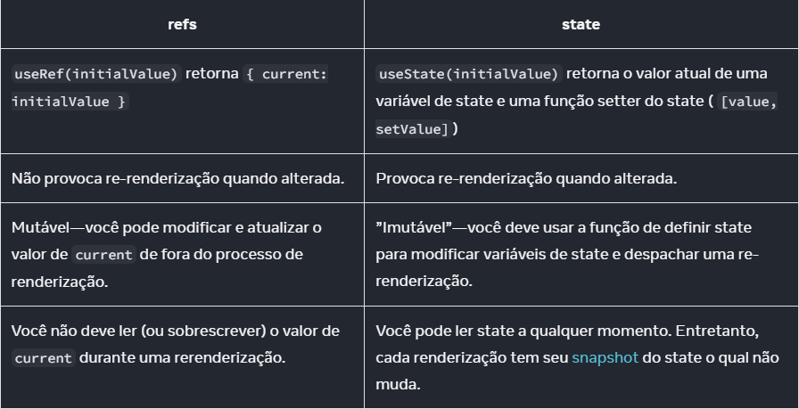

# Curso Learn React (20hrs)

## Primeira Lição

### Nesta lição, aprendemos que:

-    O React é um framework front-end modular, escalável, flexível e popular.
-    JSX é uma extensão de sintaxe para JavaScript que nos permite tratar HTML como expressões.
-    Eles podem ser armazenados em variáveis, objetos, matrizes e muito mais!
-    Os elementos JSX podem ter atributos e ser aninhados uns nos outros, assim como no HTML.
-    JSX deve ter exatamente um elemento externo, e outros elementos podem ser aninhados dentro.
-    createRoot() de react-dom/client pode ser usado para criar uma raiz React no elemento DOM especificado.
-    A React rootilits render() método pode ser usado para renderizar JSX na tela.
-    A React rootilits render() o método atualiza apenas os elementos DOM que foram alterados usando o DOM virtual.
-    À medida que você continua a aprender mais sobre o React, você aprenderá algumas coisas poderosas que você pode fazer com o JSX, alguns problemas comuns do JSX e como evitá-los.

## Segunda Lição

### Nesta lição, você aprendeu sobre um conceito fundamental do React: componentes.

-    As aplicações de reação são compostas de componentes.
-    Os componentes são responsáveis pela renderização de peças da interface do usuário.
-    Para criar componentes e renderizá-los, react e reactDOM deve ser importado.
-    Componentes de reação podem ser definidos com funções Javascript para fazer componentes da função.
-    Os nomes dos componentes da função devem começar com uma letra maiúscula, e o caso Pascal é a convenção de nomenclatura adotada.
-    Os componentes da função devem retornar alguns elementos React JSX sintaxe.
-    Os componentes do React podem ser exportados e importados de arquivo para arquivo.
-    Um componente React pode ser usado chamando o nome do componente em uma sintaxe de tag de fechamento automático semelhante ao HTML.
-    Renderizar um componente React requer o uso de .createRoot() para especificar um contêiner raiz e chamar o .render() método nele.

## Terceira Lição

### Nesta lição, aprendemos:

-    Os componentes da função podem retornar múltiplos JSX linhas aninhando os elementos em um elemento pai.
-    Atributos variáveis podem ser usados dentro de um componente React com injeções JavaScript.
-    Os componentes de reação suportam a lógica colocando as instruções lógicas acima das instruções de retorno.
-    Os componentes podem retornar condicionalmente elementos JSX colocando instruções condicionais dentro dos componentes.
-    Os componentes podem responder a eventos definindo

## Quarta Lição

### Nesta lição, aprendemos que:

-    Um aplicativo React pode conter vários componentes.
-    Os componentes podem interagir uns com os outros retornando instâncias uns dos outros.
-    A interação de componentes permite que eles sejam divididos em componentes menores, armazenados em arquivos separados e reutilizados quando necessário.

## Quinta Lição

### Nesta lição, aprendemos que:

-    Passando um suporte, dando um atributo para uma instância de componente.
-    Acessando um suporte passado via props.propName.
-    Exibindo um adereço.
-    Usando um suporte para tomar decisões sobre o que exibir.
-    Definindo um manipulador de eventos em um componente de função.
-    Passando um manipulador de eventos como um adereço.
-    Receber um manipulador de eventos prop e anexá-lo a um ouvinte de eventos.
-    Nomear manipuladores de eventos e atributos de manipuladores de eventos de acordo com uma convenção.
-    Acessando props.children.
-    Atribuindo valores padrão para props.

## Sexta Lição

### Nesta lição, aprendemos que:

-    Com o React, alimentamos modelos de dados estáticos e dinâmicos para JSX para renderizar uma visualização para a tela.
-    Ganchos são utilizados para “hook into” o estado do componente interno para a gestão de dados dinâmicos em componentes de função.
-    Nós empregamos o State Hook usando o código abaixo. O currentState referências ao valor atual do estado e initialState inicializa o valor do estado para a primeira renderização do componente.
-    const [currentState, stateSetter] = useState( initialState );
-    Setters de estado podem ser chamados em manipuladores de eventos.
-    Podemos definir manipuladores de eventos simples em linha em nosso JSX e manipuladores de eventos complexos fora do nosso JSX.
-    Usamos uma função de retorno de chamada de setter de estado quando nosso próximo valor depende do nosso valor anterior.
-    Usamos arrays e objetos para organizar e gerenciar dados relacionados que tendem a mudar juntos.
-    Use a sintaxe de propagação em coleções de dados dinâmicos para copiar o estado anterior para o próximo estado assim: setArrayState((prev) => [ ...prev ]) e setObjectState((prev) => ({ ...prev })).
-    A melhor prática é ter vários estados mais simples em vez de ter um objeto de estado complexo.

## Sétima Lição

### Nesta lição, aprendemos que:

-    Podemos importar o useEffect() função do 'react' biblioteca e chamá-lo em nossos componentes de função.
-    Efeito refere-se a uma função que passamos como o primeiro argumento do useEffect() função. Por padrão, o Effect Hook chama esse efeito após cada renderização.
-    O função de limpeza é opcionalmente retornado pelo efeito. Se o efeito fizer qualquer coisa que precise ser limpa para evitar vazamentos de memória, o efeito retornará uma função de limpeza, em seguida, o Gancho de Efeito chamará essa função de limpeza antes de chamar o efeito novamente, bem como quando o componente estiver sendo desmontado.
-    O matriz de dependência é o segundo argumento opcional que o useEffect() a função pode ser chamada com a fim impedir repetidamente chamar o efeito quando este não é necessário. Essa matriz deve consistir em todas as variáveis das quais o efeito depende.
-    O Effect Hook é tudo sobre o agendamento quando nosso código effectilits é executado. Podemos usar a matriz de dependência para configurar quando nosso efeito é chamado das seguintes maneiras:
-    Os ganchos nos dão a flexibilidade de organizar nosso código de maneiras diferentes, agrupando dados relacionados, bem como separando preocupações

## Oitava Lição

### Nesta lição, aprendemos que:

-    Identificou-se que o componente original precisava ser refatorado: tratava de cálculos/lógica e apresentação/renderização.
-    Criou um componente de contêiner contendo toda a lógica stateful.
-    Criou uma função que chama o método de configuração de estado fornecido por useState().
-    Componentes de apresentação criados e exportados contendo apenas JSX.
-    Importou os componentes de apresentação para o componente de contêiner.
-    Utilizou os componentes de apresentação na declaração de retorno do componente de contêiner.
-    Estado passado e funções usadas para alterar o estado como props para os componentes de apresentação renderizados.

## Nona Lição

### Nesta lição, aprendemos que:

-    Os componentes do React podem ser estilizados de várias maneiras diferentes: estilo em linha, estilo variável de objeto, folhas de estilo e módulos CSS.
-    O estilo em linha pode ser usado para aplicar estilos a um único elemento. O estilo em linha pode ser feito dando ao elemento um atributo chamado style cujo valor é um objeto literal cercado por chaves.
-    Uma variável de objeto também pode ser usada para aplicar um estilo a um único elemento. A sintaxe é semelhante ao estilo inline, mas em vez de passar um objeto literal, o nome da variável é passado em vez disso.
     const myStyle = { color: "red" }
-    Os nomes de estilo no React devem estar no camelCase. Por exemplo, background-color torna-se backgroundColor.
-    No React, um valor de estilo numérico é interpretado automaticamente com px.
-    Os estilos podem ser separados e armazenados em arquivos de módulo CSS. Os estilos podem ser importados e usados aplicando className atributos aos elementos relevantes.

## Décima Lição

### Nesta lição, aprendemos que:

-    O estado de um formulário React é gerenciado pelo componente e as atualizações são acionadas pelo onChange evento.
-    O onChange o evento usa um manipulador de eventos para capturar alterações e determinar quais ações devem ser tomadas.
-    Um formulário React usa o hook de estado para armazenar o valor do campo de entrada no estado componentilits. O estado pode então ser atualizado com o setter de estados.
-    Os componentes de reação podem ser controlados ou não controlados. A maioria dos formulários React são controlados, pois controlam o valor inputilits com o estado.

# Documentação:

-    Em ciência da computação (e especialmente no mundo da programação funcional), o, uma função pura é uma função com as seguintes características:

     -    Ele cuida de seu próprio negócio. Ele não altera nenhum objeto ou variável que existia antes de ser chamado.
     -    Mesmas entradas, mesma saída. Dadas as mesmas entradas, uma função pura deve sempre retornar o mesmo resultado.

-    e.stopPropagation() impedir que os manipuladores de eventos associados às tags superiores sejam acionados.
-    e.preventDefault() impedir que o navegador execute o comportamento padrão associado a determinados eventos.

-    O porque de usar useState() e não variaveis comuns: 1. Variáveis locais não persistentes entre renderizações. Quando o React renderiza esse componente uma segunda vez, ele o faz do principio—sem considerar quem quer mudanças às variáveis locais. 2. Mudanças às variáveis locais não acionam renderizações. O React não percebe que precisa renderizar o componente novo com os novos dados.

-    ### **Matriz**:

     -    **Adicionando**:
          -    Muda a matriz (evitar): push, unshift
          -    Retorna uma nova matriz (preferir): concat, [...arr] sintaxe de propagação
     -    **Removendo**:
          -    Muda a matriz (evitar): pop, shift, splice
          -    Retorna uma nova matriz (preferir): filter, slice
     -    **Substituindo**:
          -    Muda a matriz (evitar): splice, arr[i] = ... atribuição
          -    Retorna uma nova matriz (preferir): map
     -    **Classificando**:

          -    Muda a matriz (evitar): reverse, sort
          -    Retorna uma nova matriz (preferir): copie a matriz primeiro

### Princípios para estruturar useStates()

-    Quando você escreve um componente que mantém algum estado, você terá que fazer escolhas sobre quantas variáveis de estado usar e qual deve ser a forma dos dados. Embora seja possível escrever programas corretos mesmo com uma estrutura de estado subótima, existem alguns princípios que podem orientá-lo a fazer escolhas melhores:

     -    Agrupe estados relacionados. Se você sempre atualiza duas ou mais variáveis de estado ao mesmo tempo, considere uni-las em uma única variável de estado.
     -    Evite contradições no estado. Quando o estado é estruturado de forma que várias partes do estado possam se contradizer e “discordar” umas das outras, você deixa espaço para erros. Tente evitar isso.
     -    Evite estados redundantes. Se você puder calcular algumas informações das props do componente ou de suas variáveis de estado existentes durante a renderização, não coloque essas informações no estado desse componente.
     -    Evite duplicação no estado. Quando os mesmos dados são duplicados entre várias variáveis de estado, ou dentro de objetos aninhados, é difícil mantê-los sincronizados. Reduza a duplicação quando puder.
     -    Evite estados muito aninhados. Um estado muito hierárquico não é muito conveniente para atualizar. Quando possível, prefira estruturar o estado de forma plana.

          ```
          const [x, setX] = useState(0);
          const [y, setY] = useState(0);
          ```

          Troque por

          ```
          const [position, setPosition] = useState({ x: 0, y: 0 });
          ```

### useContext()

-    O contexto permite que um componente pai forneça dados para toda a árvore abaixo dele. Há muitos usos para o contexto.
-    Você pode fazer isso com props sozinho. É aqui que o contexto entra em jogo. Você fará isso em três etapas:

          1. Criar um contexto. (Você pode chamá-lo LevelContext, uma vez que it“s para o nível de cabeçalho.)
          2. Usar esse contexto do componente que precisa dos dados. (Heading usar LevelContext.)
          3. Fornecer esse contexto do componente que especifica os dados. (Section irá fornecer LevelContext.)

-    Contexto permite que um pai—mesmo um distante!—fornecer alguns dados para toda a árvore dentro dele.


-    Casos para usar o useContext()
     -    **Temática**: Se o aplicativo permitir que o usuário altere sua aparência (por exemplo, modo escuro), você poderá colocar um provedor de contexto na parte superior do aplicativo, e use esse contexto em componentes que precisam ajustar sua aparência visual.
     -    **Conta corrente**: Muitos componentes podem precisar conhecer o usuário conectado no momento. Colocá-lo em contexto torna conveniente lê-lo em qualquer lugar da árvore. Alguns aplicativos também permitem que você opere várias contas ao mesmo tempo (por exemplo, para deixar um comentário como um usuário diferente). Nesses casos, pode ser conveniente envolver uma parte da UI em um provedor aninhado com um valor de conta corrente diferente.
     -    **Roteamento**: A maioria das soluções de roteamento usa o contexto internamente para manter a rota atual. É assim que cada link “knows” se it“ está ativo ou não. Se você construir seu próprio roteador, você pode querer fazê-lo também.
     -    **Estado de gestão**: À medida que seu aplicativo cresce, você pode acabar com muito estado mais perto do topo do seu aplicativo.Muitos componentes distantes abaixo podem querer alterá-lo. É comum a use um redutor junto com o contexto para gerenciar o estado complexo e passá-lo para componentes distantes sem muito aborrecimento.

### useReducer()

-    Um redutor ajuda a manter os manipuladores de eventos curtos e concisos. No entanto, à medida que seu aplicativo cresce, você pode encontrar outra dificuldade

### useRef()

-    Quando desejar que um componente “guarde” alguma informação, mas não que ela acione novas renderizações, você pode usar uma ref:
-    ```
     const ref = useRef(0);
     ```
-    Alguns usos do useRef():

     1. Você pode acessar o valor atual daquele ref através da propriedade ref.current. Esse valor é intencionalmente mutável, o que significa que você pode tanto ler quanto escrever sobre ele. É como um bolso secreto do seu componente o qual o React não rastreia
          ```
          import { useRef } from 'react';
          let ref = useRef(0);
          function handleClick() { ref.current }
          ```
     2. inputRef.current.focus();

-    O React não permite que um componente acesse os nós DOM de outros componentes. Nem mesmo para seus próprios filhos! Isso é intencional. Refs são uma escotilha de fuga que deve ser usada com moderação. Manualmente manipulando outro os nós DOM do ComponentIcotiCats tornam seu código ainda mais frágil.
-    

### useEffect()

-    Effects são uma saída de emergência do paradigma do React. Eles permitem que você “contorne” o React e sincronize seus componentes com algum sistema externo. Se não houver sistema externo envolvido (por exemplo, se você quiser atualizar o estado de um componente com props ou mudança de estado), você não deveria usar um Effect. Remover Effects desnecessários tornará seu código mais fácil de se entender, mais rápido e menos propenso a erros.
-    Effects têm um ciclo de vida diferente dos componentes. Componentes podem se montar, atualizar ou desmontar. Um Effect só pode fazer duas coisas: começar a sincronizar algo e, mais tarde, parar a sincronização. Esse ciclo pode acontecer múltiplas vezes se seu Effect depender de props e estado que possam mudar ao longo do tempo.
-    Para escrever um efeito, siga estes três passos:
     1. **Declarar um Efeito**. Por padrão, seu efeito será executado após cada comprometer.
     2. **Especifique as dependências de efeito**. A maioria dos Efeitos deve ser executada novamente quando necessário em vez de depois de cada renderização. Por exemplo, uma animação de fade-in só deve ser acionada quando um componente aparece. A conexão e desconexão a uma sala de bate-papo só deve acontecer quando o componente aparece e desaparece ou quando a sala de bate-papo muda. Você aprenderá como controlar isso especificando dependências.
     3. **Adicione a limpeza, se necessário**. Alguns efeitos precisam especificar como parar, desfazer ou limpar o que eles estavam fazendo. Por exemplo, “connect” precisa de “disconnect”, “subscribe” precisa de “unsubscribe” e “fetch” precisa de “cancel” ou “ignore”. Você aprenderá como fazer isso retornando um função de limpeza.
-    Loop infinito:

     ```
     const [count, setCount] = useState(0);

     useEffect(() => {
     setCount(count + 1);
     });
     ```

     -    Efeitos executados como um resultado de renderização. Definir estado gatilhos renderização. Definir o estado imediatamente em um efeito é como conectar uma tomada de energia em si mesma. O Efeito é executado, ele define o estado, o que causa uma re-renderização, o que faz com que o Efeito seja executado, ele define o estado novamente, isso causa outra re-renderização, e assim por diante.

-    A matriz de dependências pode conter várias dependências. O React só pulará a execução do efeito novamente se tudo das dependências especificadas, você tem exatamente os mesmos valores que tinham durante a renderização anterior.
-    O React chamará sua função de limpeza cada vez antes que o efeito seja executado novamente e uma última vez quando o componente for desmontado (será removido). Letilits ver o que acontece quando a função de limpeza é implementada
-    Cada efeito em seu código deve representar um processo de sincronização separado e independente.

-    ### Como remover Effects desnecessários
     -    Existem dois casos comuns em que você não precisa de Effects:
          -    Você não precisa de Effects para manipular seus dados para renderização.
          -    Você não precisa de Effects para lidar com eventos do usuário.
     -    Casos que você precisa de Effects:
          -    Você precisa de Effects para sincronizar com sistemas externos.
          -    Também é possível buscar dados com Effects.
